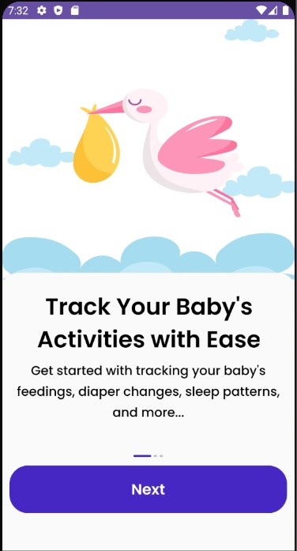
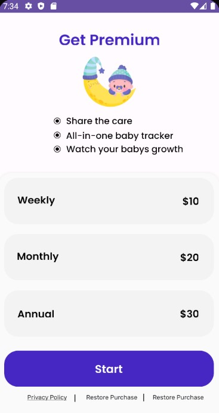
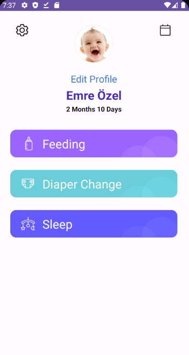
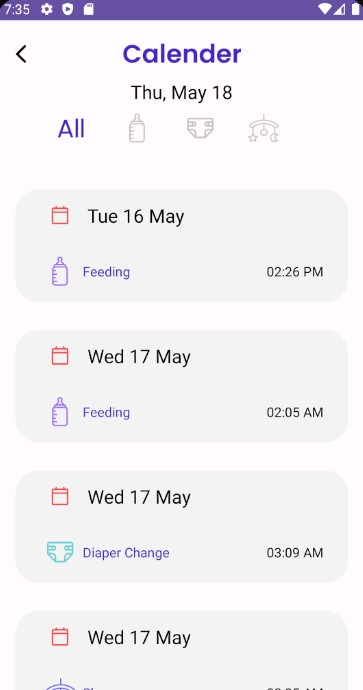

# BabyTracker
 
# The tools I have used to gain the Android Clean Architecture are:

- MMVM
- Room
- Live Data & Flow
- Data Layer 
- Coroutines

  ## Some screenshots from the application":

  
  

